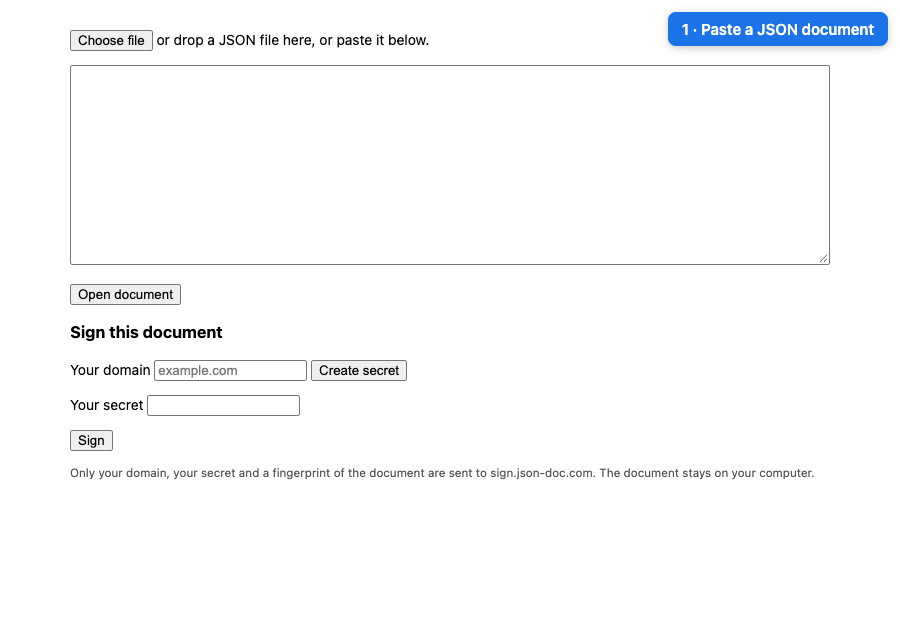

# JSON Doc

Exchange business documents as signed JSON: readable, portable and verifiable.



**Use it:** https://json-doc.com — or download `index.html` and open it in a browser.

## Why

Business documents are usually created from data that software already has, sent to another party, and turned back into data there. Connecting both sides' systems takes time, so files keep being sent by email.

JSON Doc lets you send the data itself, as JSON, and keeps it:

- **Readable:** shown as a document you can print.
- **Portable:** it's just a file, so you can keep using email.
- **Verifiable:** a signature shows who sent it (their domain) and whether it has been changed.

The app is one HTML file with no dependencies. Documents never leave your browser: signing sends only a fingerprint of the document.

## Quick start

**Read a document:** open https://json-doc.com, choose, drop or paste a JSON document, and click **Open document**.

Try it with the files in [`samples/`](samples/): `invoice.json` (plain), `invoice.signed.json` (✓), `invoice.self-signed.json` (⚠) and `invoice.tampered.json` (✗).

**Sign a document**

First time:

1. Add the document. Under **Sign this document**, enter your domain and click **Create secret**. Save the secret somewhere safe: anyone who has it can sign as your domain.
2. Click **Sign**. The page shows a DNS record.
3. Add that record where you manage your domain's DNS.
4. Click **Sign** again, then download the signed document.

Next time: add the document, enter your domain and secret, and click **Sign**.

If your secret is lost or leaked, remove its DNS record. Nobody can sign with that secret any more. Documents already signed stay valid.

## Reading the result

**Open document** shows the JSON as a document in a new tab, ready to print:

- Plain values → label and value, laid out in a compact grid
- Objects → indented sections
- Lists of values → bullet lists
- Lists of objects → tables
- Keys like `invoice_number` or `invoiceNumber` → "Invoice Number"
- `null` or a missing table cell → —

If the document is signed, a banner above it shows the result:

- **Green ✓ Signed by example.com** — a [trusted](#how-signing-works) signing server confirms who signed it and when, and the document is unchanged.
- **Amber ⚠ Signer not confirmed** — the document is unchanged since it was signed, but nobody confirms who signed it (self-signed). Ask the signer if the key shown is theirs.
- **Red ✗** — the document or signature was changed, is missing, or comes from a server JSON Doc does not trust.
- **No banner** — not a signed file.

Changing any value in a signed document breaks its signature.

**✓ Signed by example.com** means whoever controls example.com signed this document at the time shown, and it hasn't changed since. Only trust a ✓ you see after opening the file yourself in JSON Doc: a screenshot or printout can be faked.

Signature checks need a recent browser and a secure page: https://json-doc.com, or `index.html` opened from your own computer.

## Repository

| Path                   | What it is                                                                                  |
| ---------------------- | ------------------------------------------------------------------------------------------- |
| `index.html`           | The whole app: reads, signs and verifies documents. Served at https://json-doc.com.         |
| `server/worker.js`     | The signing server. Runs on Cloudflare Workers as-is, or on any host with `server/node.js`. |
| `server/node.js`       | Runs the signing server on Node.js instead.                                                 |
| `server/wrangler.toml` | Cloudflare settings for sign.json-doc.com.                                                  |
| `server/package.json`  | Lets Node.js load the server files.                                                         |
| `samples/`             | Example documents for each result.                                                          |
| `assets/`              | The demo animation in this README.                                                          |
| `CNAME`                | Tells GitHub Pages to serve the app at json-doc.com.                                        |

## How signing works

A signed file has exactly two top-level fields, `document` and `signature`. Any other top-level field makes it a plain file.

The signature covers `document` in canonical JSON ([RFC 8785](https://www.rfc-editor.org/rfc/rfc8785)): keys sorted, no whitespace. So key order and whitespace don't matter, but changing any value, value type (`40` vs `"40"`) or array order breaks the signature.

**Server-signed** (✓): a signing server confirms which domain signed the document, and when.

```json
{
  "document": { "...": "the content that was signed" },
  "signature": {
    "server": "sign.example.org",
    "domain": "northwind.example",
    "time": "2026-10-01T09:30:00.000Z",
    "value": "base64 signature"
  }
}
```

JSON Doc only trusts servers in the `SERVERS` list in `index.html`, starting with `sign.json-doc.com`, and checks the signature with the key from that list, never from the file. Readers can add servers to their own copy of `index.html`.

**Self-signed** (⚠): the signer uses their own key and includes it in the file. No server is needed.

```json
{
  "document": { "...": "the content that was signed" },
  "signature": {
    "publicKey": "base64 Ed25519 public key (SPKI)",
    "value": "base64 Ed25519 signature"
  }
}
```

To make one:

1. Turn `document` into canonical JSON.
2. Sign that text (UTF-8) with an Ed25519 private key.
3. Put the signature in `signature.value` and the public key in `signature.publicKey`, both as standard base64 with padding. Any edit to their text, even removing `=`, makes the signature fail.

## Use a signing server

Sign from code with an existing signing server. These steps use sign.json-doc.com; to use another server, replace its address in step 3. There is no registration: the server checks the domain's DNS record on every request.

1. Create a secret. This keeps it in the shell variable `SECRET` for the next steps and prints it once. Save the printed secret somewhere safe.
   ```bash
   export SECRET=$(openssl rand -base64 32)
   echo "$SECRET"
   ```
2. Add a TXT record in your domain's DNS settings:
   - **Name:** `_json-doc.` followed by your domain, e.g. `_json-doc.example.com`.
   - **Value:** your secret's fingerprint, printed by:
     ```bash
     printf %s "$SECRET" | shasum -a 256 | cut -d' ' -f1
     ```
3. Sign. This Node.js command reads `invoice.json`, sends its fingerprint with your domain and secret to sign.json-doc.com, and saves the signed document as `invoice.signed.json`. Replace `invoice.json` and `example.com` with your own.
   ```bash
   node -e '
   const doc = JSON.parse(require("fs").readFileSync(process.argv[1], "utf8"));
   const canonical = v => JSON.stringify(v, (_, x) => x && typeof x === "object" && !Array.isArray(x) ? Object.fromEntries(Object.keys(x).sort().map(k => [k, x[k]])) : x);
   const hash = require("crypto").createHash("sha256").update(canonical(doc)).digest("hex");
   fetch("https://sign.json-doc.com/sign", { method: "POST", headers: { "content-type": "application/json" },
     body: JSON.stringify({ domain: process.argv[2], token: process.env.SECRET, hash }) })
     .then(async r => { const body = await r.json(); if (!r.ok) { console.error(body.error); process.exit(1); }
       console.log(JSON.stringify({ document: doc, signature: body }, null, 2)); });
   ' invoice.json example.com > invoice.signed.json
   ```

To call the API from your own code: `POST /sign` with `{ "domain": "example.com", "token": "<secret>", "hash": "…" }` returns the `signature` object, where `hash` is the hex SHA-256 of the canonical `document`. The signed file is `{ "document": …, "signature": … }`. `GET /key` returns the server's public key.

## Host your own signing server

1. Create the server's private key. Keep it secret.
   ```bash
   node -e 'console.log(require("crypto").generateKeyPairSync("ed25519").privateKey.export({ type: "pkcs8", format: "der" }).toString("base64"))'
   ```
2. Run it in one of two ways:
   - **Any server with Node.js 20 or later** (your own machine, a VPS, or a container platform). Put it behind HTTPS. It logs to `signed.log`.
     ```bash
     SERVER_NAME=sign.example.org SIGNING_KEY=<key> node server/node.js
     ```
   - **Cloudflare Workers** (HTTPS included). `server/wrangler.toml` is set up for sign.json-doc.com: change `SERVER_NAME` and `routes`, and replace the `LOG` id with your own log from `npx wrangler kv namespace create LOG`. Then, in `server/`:
     ```bash
     npx wrangler deploy
     npx wrangler secret put SIGNING_KEY
     ```
3. To sign with it from your copy of JSON Doc, set `SIGN_SERVER` in `index.html`.

**Getting your server trusted**

JSON Doc only accepts signatures from servers in its trusted list, `SERVERS` in `index.html`. To add your server, open a pull request. It is accepted if the server:

- runs `server/worker.js`, or checks domains with DNS the same way
- uses an accurate clock
- keeps its private key secret
- keeps its log

**If a server's private key leaks**

Add an `until` time to the server's entry in the trusted list:

```js
'sign.json-doc.com': [{ publicKey: 'MCow…', until: '2026-11-05T14:00:00Z' }],
```

Documents signed from that time on show ✗. Earlier ones still show ✓, so check any doubtful ones against the server's log.

## License

MIT
